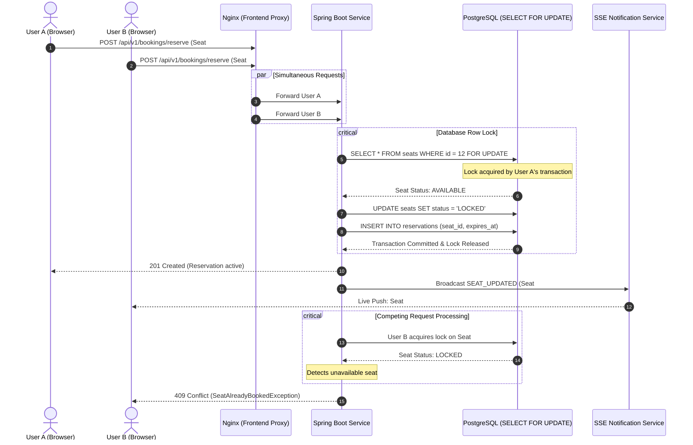

# Ticket Booking Engine

A high-concurrency seat reservation and booking system built with **Java 22, Spring Boot 3, and PostgreSQL**, accompanied by a reactive **React + TypeScript frontend**.
The project demonstrates enterprise-grade transaction handling, pessimistic row-level locking (SELECT ... FOR UPDATE) to eliminate race conditions and double-booking, real-time client state synchronization using Server-Sent Events (SSE), and zero-configuration orchestration via Docker Compose.

## Key Highlights & Architecture

- **Pessimistic Concurrency Control:** Enforces atomic seat state transitions (AVAILABLE → LOCKED → BOOKED) via row-level locks in PostgreSQL, rejecting concurrent duplicate attempts with business exceptions.
- **Server-Sent Events (SSE):** Pushes live seat state updates instantaneously to connected clients without continuous HTTP polling overhead.
- **Automated Hold Expiration:** Scheduled background task releases abandoned or expired reservations automatically.
- **Stress-Tested Multi-Threading:** Comprehensive JUnit 5 integration suite using CountDownLatch and concurrent thread pools simulating high-volume ticket drops.
- **Clean Monorepo & Containerization:** Unified multi-stage Docker build running PostgreSQL, Spring Boot, and Vite/Nginx with reverse proxy routing.
 
## Concurrency Flow
 


## Tech Stack
### Backend 
- **Language & Framework:** Java 22, Spring Boot 3.3.4
- **Persistence & ORM:** Spring Data JPA, Hibernate, PostgreSQL 16
- **Real-Time:** Spring MVC SseEmitter (Server-Sent Events)
- **API Documentation:** Springdoc OpenAPI (Swagger UI)
- **Testing:** JUnit 5, AssertJ, Spring Boot Test, ThreadPoolExecutor & CountDownLatch
### Frontend & Proxy
- **Framework:** React 18, TypeScript, Vite
- **Styling:** Custom CSS Grid UI with status-driven visual feedback
- **Web Server & Reverse Proxy:** Nginx Alpine (proxying /api/ and SSE stream)
### DevOps & Infrastructure
- **Containerization:** Multi-stage Docker builds
- **Orchestration:** Docker Compose
- **JDK Base Image:** Eclipse Temurin 22 Alpine

## Quick Start (Zero-Config Docker)
### Prerequisites
- Docker Desktop installed and running.

## 1. Clone & Launch
```
git clone https://github.com/<your-username>/ticket-booking-engine.git
cd ticket-booking-engine

# Build and start PostgreSQL, Backend, and Frontend
docker compose up --build
```

## 2. Access Services
- Web Application: http://localhost:3000 
- REST API Endpoints: http://localhost:8080/api/v1/bookings
- Swagger UI Documentation: http://localhost:8080/swagger-ui.html
- PostgreSQL Database: localhost:5432 (ticket_db / postgres / password)

## Running Concurrency Integration Tests
The test suite contains multithreaded integration tests validating pessimistic locking integrity under high contention:
```
cd backend
./mvnw test -Dtest=BookingConcurrencyTest
```

## Test Scenario (BookingConcurrencyTest)
- A single available seat (VIP-1) is registered.
- Competing threads hit lockAndReserveSeat() simultaneously synchronized via CountDownLatch.
- **Assertion:** Exactly 1 thread secures the lock and obtains a 201 reservation, while remaining threads encounter SeatAlreadyBookedException. The database seat status transitions safely to LOCKED.

## REST API Overview
| Method | Endpoint | Description |
| :--- | :--- | :--- |
| `GET` | `/api/v1/bookings/events/{eventId}/seats` | Fetches all seats and current statuses for the event grid |
| `POST` | `/api/v1/bookings/reserve` | Locks a seat with a 10-minute payment expiration window |
| `POST` | `/api/v1/bookings/{reservationId}/confirm-payment` | Confirms payment and permanently transitions seat to `BOOKED` |
| `GET` | `/api/v1/bookings/stream` | Server-Sent Events stream for real-time seat update broadcasts |

## License
This project is open-source and available under the MIT License.
